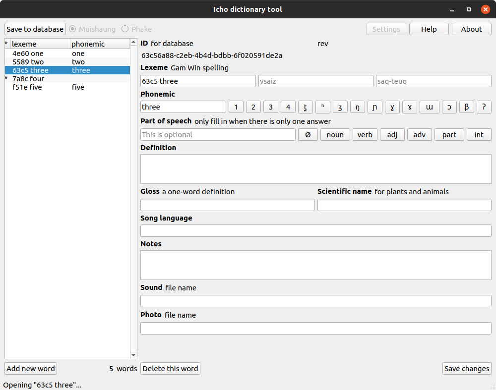

# Ichō.py

Ichō.py is a Python implementation of the Ichō dictionary tool, a management interface for collaborative dictionary creation that links in to the AilotDict mobile phone dictionary software.

The original version was built with Electron and Node.js, with PouchDB for local storage. It was intended more as a proof of concept than an actual production-quality tool. However, due to time constraints, the Electron version was put into the workflow for a couple dictionaries currently being developed.

It has been redeveloped in Python 3.6 with Qt5 to provide a more lightweight implementation and a more reliable app for a wide range of platforms. Electron has issues.

## Screenshot

